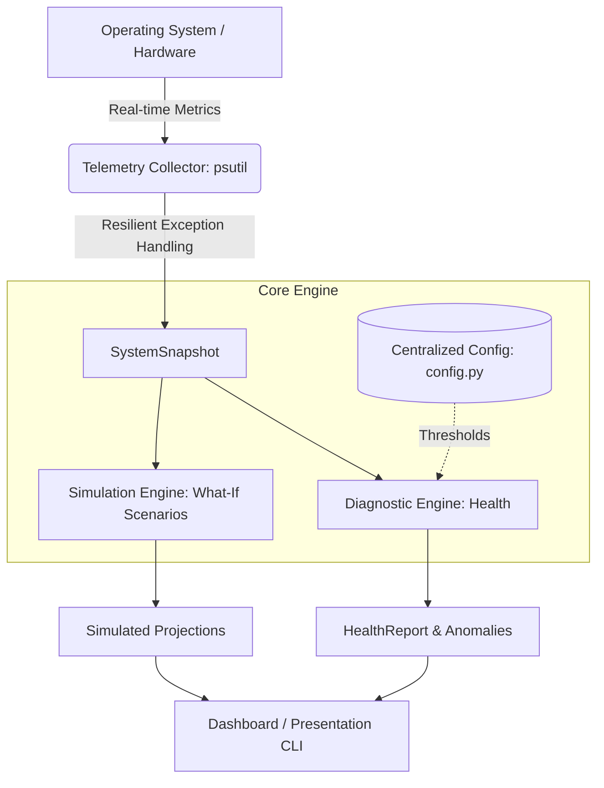

# Digital Twin for Computer Systems

[](https://github.com/Aryam92/digital-twin-for-computer-systems/actions)
[](https://github.com/codespaces/new?repo=Aryam92/digital-twin-for-computer-systems)
[](https://www.python.org/)
[](https://opensource.org/licenses/MIT)

A modular Python implementation of a **Digital Twin** designed for real-time computer system monitoring, health diagnostics, anomaly detection, and what-if stress simulations.

---

## System Architecture



### Architecture Highlights
* **Telemetry Collector (`monitoring`):** Gathers real-time OS performance counters with resilient fallbacks for hardware/permission faults.
* **Diagnostic Engine (`health`):** Evaluates multi-variable resource health against centralized, configurable thresholds.
* **Simulation Engine (`simulation`):** Generates immutable synthetic workloads to forecast hardware stress without affecting live OS stability.
* **Configuration Module (`config`):** Centralized domain thresholds implemented via immutable dataclasses.

---

## Key Features

* **Real-Time Telemetry:** Monitors CPU utilization, memory pressure, disk consumption, network I/O, and active process count.
* **Dynamic Health Scoring:** Evaluates system health on a 0-100 scale with Healthy, Warning, and Critical states.
* **What-If Simulation:** Executes stress scenarios (Normal, Heavy, Critical Workloads) predicting operational state changes.
* **Fault Resilience:** Employs defensive exception handling preventing runtime crashes on permission or telemetry read errors.
* **Automated CI/CD:** Verified via GitHub Actions test runners across all commits.
* **Cloud Ready:** Immediate evaluation via pre-configured GitHub Codespaces (`.devcontainer`).

---

## Getting Started & Installation

### Prerequisites
* Python 3.11 or higher
* `pip` package manager

### 1. Clone the Repository
```bash
git clone [https://github.com/Aryam92/digital-twin-for-computer-systems.git](https://github.com/Aryam92/digital-twin-for-computer-systems.git)
cd digital-twin-for-computer-systems
```

### 2. Install Dependencies
```bash
pip install -r requirements.txt
```

---

## How to Run

### Run the Real-Time Monitoring Dashboard
Runs live diagnostics and stress simulations on your active resources:
```bash
python -m digital_twin
```

### Automated Testing Suite
Run the 10-test suite verifying system health thresholds, anomalies, and simulation immutability:
```bash
set PYTHONPATH=src
python -m unittest discover -s src/tests -v
```
